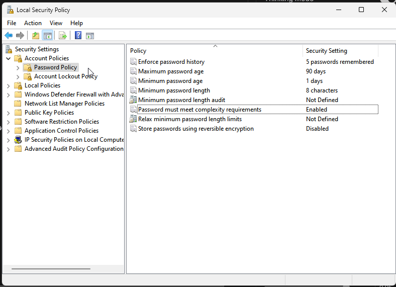
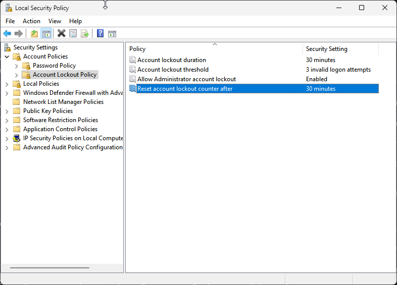
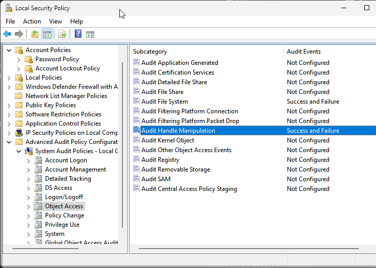

# Звіт

## 1. Неформально задана політика безпеки КС

**1.1. Політика керування паролями:**

* **Мінімальна довжина пароля:** Паролі повинні мати довжину не менше 8 символів.
* **Складність пароля:** Паролі повинні включати символи щонайменше з трьох із цих чотирьох категорій: великі літери, малі літери, цифри та символи.
* **Історія паролів:** Користувачам заборонено повторно використовувати будь-які з останніх 5 паролів.
* **Мінімальний термін дії пароля:** Користувачі не можуть змінити свій пароль протягом 1 дня після його встановлення.
* **Максимальний термін дії пароля:** Паролі необхідно змінювати кожні 90 днів.
* **Поріг блокування облікового запису:** Після 3 невдалих спроб входу обліковий запис буде заблоковано.
* **Тривалість блокування облікового запису:** Заблоковані облікові записи залишатимуться заблокованими протягом 30 хвилин.

**1.2. Політика контролю доступу:**

Ця політика буде застосована до двох груп: `Admins` (наявна група) та `Users` (група, яку буде створено), а також до конкретних облікових записів користувачів.

* **Принцип найменших привілеїв:** Користувачі повинні мати доступ лише до тих ресурсів, які абсолютно необхідні для виконання їхніх робочих функцій.
* **Група `Admins`:** Члени цієї групи мають повний контроль над системою та всіма об'єктами, за винятком випадків, коли це спеціально обмежено політикою або правом власності на об'єкт.
* **Група `Users`:** Члени цієї групи мають стандартні привілеї користувача. Вони можуть читати та виконувати більшість системних файлів, але мають обмежений доступ на запис до системних каталогів.

* **Специфічний доступ до папок/файлів (6 файлових об'єктів та більше):**

  * **Папка `C:\SharedData` (буде створена):**
    * Група `Users`: Читання, Запис.
    * Група `Admins`: Повний контроль.
  * **Папка `C:\SensitiveProject` (буде створена):**
    * Користувач `User_ProjectA` (буде створений): Читання, Запис, Виконання.
    * Користувач `User_ProjectB` (буде створений): Читання, Виконання.
    * Користувач `User_Common` (буде створений, член групи `Users`): Доступу немає.
    * Група `Admins`: Повний контроль.
    * Група `Users`: Доступу немає.
  * **Файл `C:\SensitiveProject\ConfidentialDoc.txt` (буде створений):**
    * Користувач `User_ProjectA`: Читання, Запис.
    * Група `Admins`: Повний контроль.
    * Усі інші користувачі/групи: Доступу немає.
  * **Файл `C:\SharedData\PublicReport.docx` (буде створений):**
    * Група `Users`: Читання.
    * Група `Admins`: Повний контроль.
    * Творець/Власник: Повний контроль.
  * **Файл `C:\SharedData\ImportantNotes.txt` (буде створений):**
    * Група `Users`: Читання.
    * Група `Admins`: Повний контроль.
    * Творець/Власник: Повний контроль.
  * **Файл `C:\SensitiveProject\ProjectPlan.pdf` (буде створений):**
    * Користувач `User_ProjectA`: Читання.
    * Користувач `User_ProjectB`: Читання.
    * Група `Admins`: Повний контроль.
    * Усі інші користувачі/групи: Доступу немає.

**1.3. Політика реєстрації (аудиту):**

* **Налаштування політики аудиту (Локальна політика безпеки):**
  * **Аудит подій входу в обліковий запис:** Успіх та Невдача.
  * **Аудит керування обліковими записами:** Успіх та Невдача.
  * **Аудит доступу до об'єктів:** Успіх та Невдача (на глобальному рівні, потім спеціально конфігурується на об'єктах).
  * **Аудит зміни політики:** Успіх та Невдача.
  * **Аудит використання привілеїв:** Успіх та Невдача.
  * **Аудит системних подій:** Успіх та Невдача.
* **Специфічний аудит об'єктів (SACL на файлах/папках):**
  * **Папка `C:\SensitiveProject`:** Аудит невдалих спроб будь-якого користувача видалити або змінити папку/файли в ній.
  * **Файл `C:\SensitiveProject\ConfidentialDoc.txt`:** Аудит усіх успішних спроб читання та запису будь-яким користувачем, а також усіх невдалих спроб доступу будь-яким користувачем.







## 2

```powershell
Clear-EventLog -LogName Application, Security, System
```
