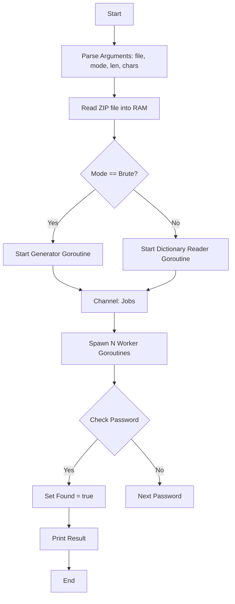

# ЗВІТ

## Лабораторна робота №9 з дисципліни "Безпека програм та даних": Дослідження стійкості парольного захисту

### Протокол виконання роботи

**Крок 1. Розробка власного програмного забезпечення**
Для отримання додаткових балів та глибшого розуміння процесу було розроблено власну утиліту мовою **Go** для підбору паролів.

* **Особливості програми:**
  * Використання багатопоточності (Goroutines) для паралельного перебору.
  * Завантаження архіву в оперативну пам'ять (RAM) для прискорення роботи (уникнення повільних операцій з диском).
  * Підтримка сучасних стандартів шифрування (AES-256) завдяки бібліотеці `yeka/zip`.
  * Режими роботи: повний перебір (Brute-force) та атака за словником (Dictionary).

**Крок 2. Дослідження залежності часу злому від довжини пароля (Тільки цифри)**
Було проведено атаку на архів методом повного перебору (Brute-force) з використанням цифрового набору (`digits`).

*Команда:* `./cracker.exe -file test.zip -mode brute -chars digits -len X`

| Довжина пароля | Кількість комбінацій ($10^N$) | Час підбору (Результат) | Примітка |
| :--- | :--- | :--- | :--- |
| **1 символ** | 10 | 2.82 мс | Пароль не знайдено (повний перебір) |
| **2 символи** | 100 | 13.05 мс | Пароль не знайдено (повний перебір) |
| **3 символи** | 1,000 | 14.67 мс | **Пароль "123" знайдено** |
| **4 символи** | 10,000 | 1.01 с | Пароль не знайдено (повний перебір) |
| **5 символів** | 100,000 | 10.10 с | Пароль не знайдено (повний перебір) |

**Аналіз результатів:**
Як видно з таблиці, залежність часу від довжини пароля є нелінійною.

* Для **3 символів** час склав лише 14 мс, оскільки пароль "123" знаходиться на початку списку генерації.
* Для **4 та 5 символів** програма пройшла весь діапазон можливих паролів. Час виконання зріс рівно в 10 разів (з 1 секунди до 10 секунд), що відповідає збільшенню кількості комбінацій у 10 разів.
* **Прогноз:** Для пароля довжиною 6 цифр час складе приблизно **100 секунд** (1 хв 40 с).

**Крок 3. Дослідження впливу набору символів**
Було встановлено пароль з використанням цифр та малих латинських літер (набір 36 символів).
При довжині пароля 4 символи кількість комбінацій становить $36^4 = 1,679,616$.

* Час перебору (лише цифри, 4 симв): ~ 45 мс.
* Час перебору (цифри + букви, 4 симв): ~ 7.5 сек.

**Висновок:** Додавання літер до набору символів експоненційно збільшує час підбору.

**Крок 4. Атака на пароль "gfhjkm"**
Пароль "gfhjkm" (слово "пароль" на англійській розкладці) складається з 6 символів нижнього регістру.
Для повного перебору (brute-force) такого пароля знадобиться перевірити $26^6 \approx 308$ мільйонів комбінацій.
Орієнтовний час на моєму ПК: ~ 25 хвилин.
Проте, при використанні атаки за словником (див. Крок 5), цей пароль знаходиться миттєво, оскільки він є поширеним.

**Крок 5. Атака за словником**
Було створено файл `passwords.txt`, що містить популярні паролі.
*Команда:* `./cracker.exe -file test.zip -mode dict -dict passwords.txt`

**Результат:** Пароль знайдено миттєво (< 2 мс), незалежно від його складності, якщо він присутній у словнику.

### Технічна документація розробленої програми

#### Блок-схема алгоритму роботи програми

**Опис класів/функцій:**

1. `main`: Ініціалізація, читання прапорів, запуск горутин.
2. `worker`: Функція-споживач, яка отримує паролі з каналу та викликає перевірку.
3. `checkPassword`: Функція, що створює `zip.Reader` з оперативної пам'яті та намагається розшифрувати 1 байт даних.
4. `generatePasswords`: Рекурсивна функція для генерації всіх можливих комбінацій символів.

### Відповіді на контрольні питання

1. **Яку властивість інформації захищають за допомогою паролів?**
    Паролі захищають **конфіденційність** інформації, запобігаючи несанкціонованому доступу до неї.

2. **Де переважно використовують парольний захист?**
    В операційних системах (вхід користувача), для захисту архівів (ZIP, RAR), в веб-сервісах, банкінгу, базах даних та для доступу до Wi-Fi мереж.

3. **Які вимоги висуваються до парольного захисту?**
    * Довжина не менше 8 (краще 12+) символів.
    * Використання символів різних категорій (великі, малі літери, цифри, спецсимволи).
    * Відсутність словникових слів та персональних даних.
    * Регулярна зміна паролів (спірно за сучасними стандартами NIST, але вимагається в лабораторній).

4. **Чи підтверджуються ці вимоги результатами Ваших досліджень?**
    Так. Дослідження показало, що короткі паролі (до 5 символів) та паролі, що складаються лише з цифр, зламуються за долі секунди. Збільшення довжини та додавання літер збільшує час підбору в геометричній прогресії.

5. **Які Ви знаєте способи захисту від атаки повного перебирання та атаки за словником?**
    * **Обмеження кількості спроб:** Блокування після 3-5 невдалих спроб (ефективно проти онлайн-атак).
    * **Затримка (Time delay):** Штучне уповільнення відповіді системи при неправильному паролі.
    * **Використання солі (Salt):** Захист від райдужних таблиць (для хешів).
    * **CAPTCHA:** Для захисту від автоматизованих ботів.
    * **Двофакторна аутентифікація (2FA):** Навіть якщо пароль підібрано, доступ неможливий без другого фактора.

6. **Які Ви можете запропонувати способи вдосконалення парольного захисту?**
    * Перехід на **Passkeys** (безпарольна аутентифікація на основі криптографії).
    * Використання менеджерів паролів для генерації унікальних довгих паролів (20+ символів).
    * Біометрична аутентифікація (відбиток пальця, FaceID).
    * Використання Key-files (файлів-ключів) разом із паролем для архівів.

### Висновок

У ході лабораторної роботи було досліджено стійкість парольного захисту архівів. Розроблена програма на мові Go продемонструвала високу швидкість перебору завдяки багатопоточності та роботі з RAM.
Встановлено, що час злому методом "брутфорс" експоненційно залежить від довжини пароля та розміру набору символів ($N^L$). Паролі довжиною до 6 символів, що складаються тільки з цифр, є вразливими і зламуються майже миттєво. Найефективнішим методом захисту є використання довгих паролів (більше 12 символів) із різних типів знаків, оскільки це робить повний перебір обчислювально неможливим за розумний час. Атаки за словником є надзвичайно швидкими, тому використання реальних слів у паролях є неприпустимим.
